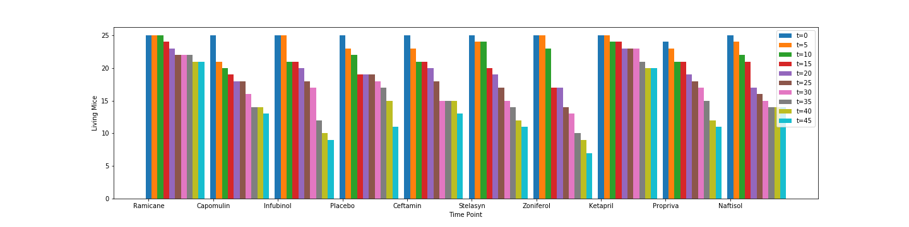
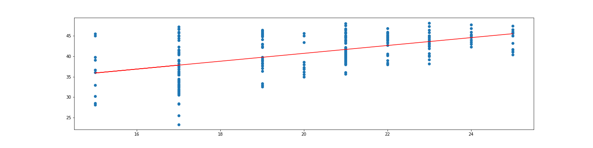

## Summary:
This project uses artificial data from a hypothetical medical study examining the effect of several pharmaceutical drugs on tumor growth rates. Experimental data from 249 mice given different treatements to impede their tumor growth. This code produces vizualizations of the data to facilitate analysis of the results of the study.

## The Files:
```
|+--pymaceuticals.ipynb -> code for generating vizualizations
|+-- data
|    +-- Mouse_metadata.csv -> study data to visualized
|    +-- Study_results.csv -> final tumor growth data
|+-- Plots
|       +--a_mouse_on_Capomulin.png -> a line plot of time point versus tumor volume for a mouse treated with Capomulin
|       +-- boxplots.png -> box plots of the final tumor volume of each mouse across four regimens of interest
|       +--linear_regression_weight_tumorvol.png -> Simple linear regression model of mouse weight vs tumor volume for mice treated with Capomulin
|       +--mice_sex.png -> Pie chart representing the sex of mice studied
|       +--survival_by_drug_over_time.png -> comparative histograms showing mouse survival over time for mice on each drug regimen
|       +--survival_by_drug_total.png -> bar chart showing number of surviving mice on each regimen
|       +-- weights_on_Capomulin.png -> scatter plot of mouse weights versus tumor volume for mice on Capomulin
```
#Key Visualizations






